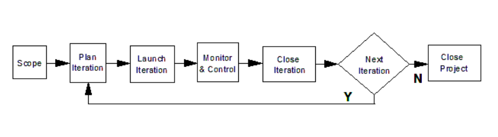

<!--buh-->
# Scoping

Per la fase di Scoping abbiamo inizialmente sviluppato parallelamente le Condition of Satisfaction (CoS) e il Project Overview Statement (POS).
Il documento che descrive le [Condition of Satisfaction](../documentazione/scopingC/CoS.md) è fondamentale per ogni progetto, e in particolare per progetti di lunga durata, in quanto permette di mantenere chiarezza riguardo alle condizioni da rispettare per garantire una buona riuscita del progetto.
Il [Project Overview Statement](../documentazione/scopingC/POS.md) invece permette di avere una visione ad alto livello del progetto analizzando gli obiettivi da conseguire e i corrispettivi rischi; inoltre definisce le assunzioni, gli ostacoli e lo scopo generale del progetto. Il documento è stato sviluppato associando direttamente gli obiettivi ai rischi e ai criteri di successo associati, ottenendo maggiore chiarezza sulle loro connessioni. 
Per offrire ulteriori approfondimenti in merito alle tematiche affrontate nel contenuto del POS abbiamo sviluppato i seguenti documenti allegati:
- [Analisi dei Rischi](../documentazione/scopingC/Analisi_rischi.md): questo documento approfondisce nel dettaglio i rischi emersi all'interno del POS catalogandoli in base alla loro gravità all'interno del nostro progetto.
- [Analisi SWOT](../documentazione/scopingC/SWOT.md): un'analisi più approfondita focalizzata nell'identificare i punti di forza (Strength), di debolezza (Weakness), le opportunità (Opportunities) e le minacce (Threats) del progetto.
- [Business Model Canvas](../documentazione/scopingC/canvas.md):  questo documento permette di visualizzare in modo semplice e strategico il modello di business, in particolare come si intende creare, distribuire e raccogliere valore.
Un ulteriore vantaggio del Business Model Canvas consiste nel favorire la coordinazione e l'integrazione di risorse e attività chiave, assicurando che tutte le parti del progetto siano allineate e lavorino in sinergia; questo è fondamentale per garantire l'efficienza operativa e il successo del progetto.

A causa dell'incertezza riguardo ai requisiti, si è pensato di creare un prototipo, da cui sono emerse ulteirori specifiche a seguito di un confronto con Mintendo. Per organizzare tali requisiti è stato realizzato un documento per l'[analisi del prototipo](../documentazione/scopingC/post_prototipo.md) che esprima gli aspetti positivi del prototipo realizzato, quelli mancanti, da aggiungere, e quelli che non sono stati approvati da eliminare o modificare. 

Terminato un primo sviluppo dei documenti descritti finora si sono creati [Requirements Breakdown Structure](../documentazione/scopingC/RBS.md) (RBS) e [user stories](../documentazione/scopingC/user_story.md). Si è deciso di sviluppare entrambi i documenti in modo da poter ottenere i vantaggi di entrambi gli approcci, in particolare l'RBS fornisce una divisione gerarchica delle funzionalità da sviluppare mentre le user stories forniscono allo sviluppatore informazioni più dettagliate sul modo in cui sviluppare le feature. 

Per analizzare le funzionalità dal punto di vista degli utenti si è deciso di realizzare un [User flow](../documentazione/scopingC/user_flow.md) che descriva i percorsi principali di utilizzo del videogioco con particolare attenzione alle modalità di gioco. L'User Flow garantisce che un progetto di grandi dimensioni non solo funzioni come previsto, ma offra anche una user experience ottimale, aumentando così la soddisfazione e la fidelizzazione degli utenti.

A seguito dello sviluppo dei documenti precedentemente descritti, questi sono stati revisionati e integrati con elementi non emersi durante la prima stesura, risolvendo eventuali incongruenze. 

Di conseguenza alla poca chiarezza sui requisiti del progetto, in particolare sulle funzionalità innovative da integrare nel videogioco, la scelta del PLMC è ricaduta su un approccio di tipo Agile sul modello iterativo, in quanto abbiamo chiarezza nei goal ma non nei requisiti, che potrebbero cambiare a causa delle interazioni con Mintendo e utenti finali.

  

