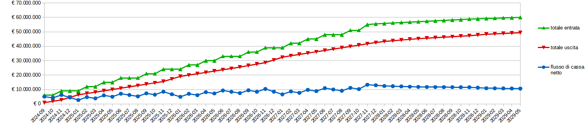

<!--@-->

# Cash flow

|data|flusso in entrata|flusso in uscita|totale entrata|totale uscita|flusso di cassa netto|
|-|-|-|-|-|-|
|2024-09|€ 6,000,000|€ 920,250|€ 6,000,000|€ 920,250|€ 5,079,750|
|2024-10| |€ 920,250|€ 6,000,000|€ 1,840,500|€ 4,159,500|
|2024-11|€ 3,000,000|€ 920,250|€ 9,000,000|€ 2,760,750|€ 6,239,250|
|2024-12| |€ 1,786,500|€ 9,000,000|€ 4,547,250|€ 4,452,750|
|2025-01| |€ 1,770,250|€ 9,000,000|€ 6,317,500|€ 2,682,500|
|2025-02|€ 3,000,000|€ 920,250|€ 12,000,000|€ 7,237,750|€ 4,762,250|
|2025-03| |€ 920,250|€ 12,000,000|€ 8,158,000|€ 3,842,000|
|2025-04|€ 3,000,000|€ 920,250|€ 15,000,000|€ 9,078,250|€ 5,921,750|
|2025-05| |€ 920,250|€ 15,000,000|€ 9,998,500|€ 5,001,500|
|2025-06|€ 3,000,000|€ 920,250|€ 18,000,000|€ 10,918,750|€ 7,081,250|
|2025-07| |€ 920,250|€ 18,000,000|€ 11,839,000|€ 6,161,000|
|2025-08| |€ 920,250|€ 18,000,000|€ 12,759,250|€ 5,240,750|
|2025-09|€ 3,000,000|€ 920,250|€ 21,000,000|€ 13,679,500|€ 7,320,500|
|2025-10| |€ 920,250|€ 21,000,000|€ 14,599,750|€ 6,400,250|
|2025-11|€ 3,000,000|€ 920,250|€ 24,000,000|€ 15,520,000|€ 8,480,000|
|2025-12| |€ 1,786,500|€ 24,000,000|€ 17,306,500|€ 6,693,500|
|2026-01| |€ 1,770,250|€ 24,000,000|€ 19,076,750|€ 4,923,250|
|2026-02|€ 3,000,000|€ 920,250|€ 27,000,000|€ 19,997,000|€ 7,003,000|
|2026-03| |€ 920,250|€ 27,000,000|€ 20,917,250|€ 6,082,750|
|2026-04|€ 3,000,000|€ 920,250|€ 30,000,000|€ 21,837,500|€ 8,162,500|
|2026-05| |€ 920,250|€ 30,000,000|€ 22,757,750|€ 7,242,250|
|2026-06|€ 3,000,000|€ 920,250|€ 33,000,000|€ 23,678,000|€ 9,322,000|
|2026-07| |€ 920,250|€ 33,000,000|€ 24,598,250|€ 8,401,750|
|2026-08| |€ 920,250|€ 33,000,000|€ 25,518,500|€ 7,481,500|
|2026-09|€ 3,000,000|€ 1,040,250|€ 36,000,000|€ 26,558,750|€ 9,441,250|
|2026-10| |€ 1,020,250|€ 36,000,000|€ 27,579,000|€ 8,421,000|
|2026-11|€ 3,000,000|€ 1,026,025|€ 39,000,000|€ 28,605,025|€ 10,394,975|
|2026-12| |€ 1,889,650|€ 39,000,000|€ 30,494,675|€ 8,505,325|
|2027-01| |€ 1,870,250|€ 39,000,000|€ 32,364,925|€ 6,635,075|
|2027-02|€ 3,000,000|€ 1,020,250|€ 42,000,000|€ 33,385,175|€ 8,614,825|
|2027-03| |€ 920,250|€ 42,000,000|€ 34,305,425|€ 7,694,575|
|2027-04|€ 3,000,000|€ 920,250|€ 45,000,000|€ 35,225,675|€ 9,774,325|
|2027-05| |€ 920,250|€ 45,000,000|€ 36,145,925|€ 8,854,075|
|2027-06|€ 3,000,000|€ 920,250|€ 48,000,000|€ 37,066,175|€ 10,933,825|
|2027-07| |€ 920,250|€ 48,000,000|€ 37,986,425|€ 10,013,575|
|2027-08| |€ 920,250|€ 48,000,000|€ 38,906,675|€ 9,093,325|
|2027-09|€ 3,000,000|€ 920,250|€ 51,000,000|€ 39,826,925|€ 11,173,075|
|2027-10| |€ 920,250|€ 51,000,000|€ 40,747,175|€ 10,252,825|
|2027-11|€ 4,000,000|€ 920,250|€ 55,000,000|€ 41,667,425|€ 13,332,575|
|2027-12|€ 500,000|€ 894,000|€ 55,500,000|€ 42,561,425|€ 12,938,575|
|2028-01|€ 300,000|€ 764,000|€ 55,800,000|€ 43,325,425|€ 12,474,575|
|2028-02|€ 300,000|€ 474,000|€ 56,100,000|€ 43,799,425|€ 12,300,575|
|2028-03|€ 300,000|€ 474,000|€ 56,400,000|€ 44,273,425|€ 12,126,575|
|2028-04|€ 300,000|€ 474,000|€ 56,700,000|€ 44,747,425|€ 11,952,575|
|2028-05|€ 300,000|€ 474,000|€ 57,000,000|€ 45,221,425|€ 11,778,575|
|2028-06|€ 300,000|€ 342,750|€ 57,300,000|€ 45,564,175|€ 11,735,825|
|2028-07|€ 300,000|€ 342,750|€ 57,600,000|€ 45,906,925|€ 11,693,075|
|2028-08|€ 300,000|€ 342,750|€ 57,900,000|€ 46,249,675|€ 11,650,325|
|2028-09|€ 300,000|€ 342,750|€ 58,200,000|€ 46,592,425|€ 11,607,575|
|2028-10|€ 300,000|€ 342,750|€ 58,500,000|€ 46,935,175|€ 11,564,825|
|2028-11|€ 300,000|€ 342,750|€ 58,800,000|€ 47,277,925|€ 11,522,075|
|2028-12|€ 200,000|€ 474,000|€ 59,000,000|€ 47,751,925|€ 11,248,075|
|2029-01|€ 200,000|€ 554,000|€ 59,200,000|€ 48,305,925|€ 10,894,075|
|2029-02|€ 200,000|€ 264,000|€ 59,400,000|€ 48,569,925|€ 10,830,075|
|2029-03|€ 200,000|€ 264,000|€ 59,600,000|€ 48,833,925|€ 10,766,075|
|2029-04|€ 200,000|€ 264,000|€ 59,800,000|€ 49,097,925|€ 10,702,075|
|2029-05|€ 200,000|€ 264,000|€ 60,000,000|€ 49,361,925|€ 10,638,075|

  

In seguito sono riportate le stime effettuate per calcolare le uscite del progetto.

|motivazione spesa|frequenza|importo|
|-|-|-|
|infrastrutture |mensile|€ 54,000| 
| costo massimo dipendente |mensile|€ 8,400| 
| costo minimo dipendente |mensile|€ 3,150| 
| costo medio dipendente |mensile|€ 5,775| 
| licenze|annuale|€ 700,000| 
| licenze considerando che 1/6 è occupato in questo progetto|annuale|€ 140,000| 
| edificio|annuale|€ 150,000| 
|outsourcing trailer| - |€ 600,000|
|outsourcing voice acting| - |€ 20,000| 

