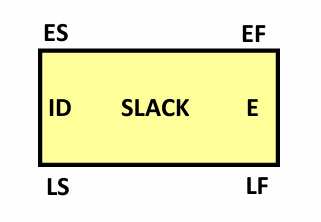

<!--O-->

# Project Network Diagram

Il project network diagram è un grafico che rappresenta le dipendenze e la possibile parallelizzazione delle task di una milestone.
Ogni task è rappresentato da un elemento analogo al sottostante:

 

Gli elementi dell'immagine sono:
- **ID:** task ID, ovvero il numero indicati nella prima colonna del [product backlog](./product_backlog)
- **E:** durata attesa misurata in giorni, calcolata secondo la seguente formula: *durata = punti funzione x 20 / 25* con 25 numero sviluppatori impiegati nel task
- **ES:** early start, primo momento utile per iniziare il task
- **LS:** late start, ultimo momento utile per iniziare il task
- **EF:** early finish, primo momento utile per finire il task
- **LF:** late finish, ultimo momento utile per finire il task
- **Slack:** ritardo massimo che può subire un task senza intaccare la durata del progetto

La sua principale utilità consiste nell'individuare gli slack, ovvero i ritardi applicabili ai task che non causino ritardi nell'intero progetto, e il percorso critico, ovvero il percorso con slack zero. Lo slack è calcolato con la seguente formula:

*slack= late finish - early fininsh*

Nel grafico prodotto sono inoltre presenti delle dipendenze finish to finish, per le quali è indicato il lag atteso, ovvero la durata in giorni necessaria per finire un'attività che dipende dalla fine di un'altra.
In seguito, è riportato il Project network diagram della prima milestone:

<iframe width="768" height="432" src="https://miro.com/app/live-embed/uXjVK6cj1v0=/?moveToViewport=-2396,-2099,13088,7104&embedId=579533345156" frameborder="0" scrolling="no" allow="fullscreen; clipboard-read; clipboard-write" allowfullscreen></iframe>

# Gantt

Basandosi sul Project network diagram, è stato prodotto il Gantt, ovvero il grafico sotto riportato, che temporizza l'analisi del Project network diagram fissandola in dei giorni di lavoro stabiliti.

<iframe width="768" height="432" src="https://miro.com/app/live-embed/uXjVK5Pz75g=/?moveToViewport=-1947,2270,5764,2631&embedId=597340757306" frameborder="0" scrolling="no" allow="fullscreen; clipboard-read; clipboard-write" allowfullscreen></iframe>
