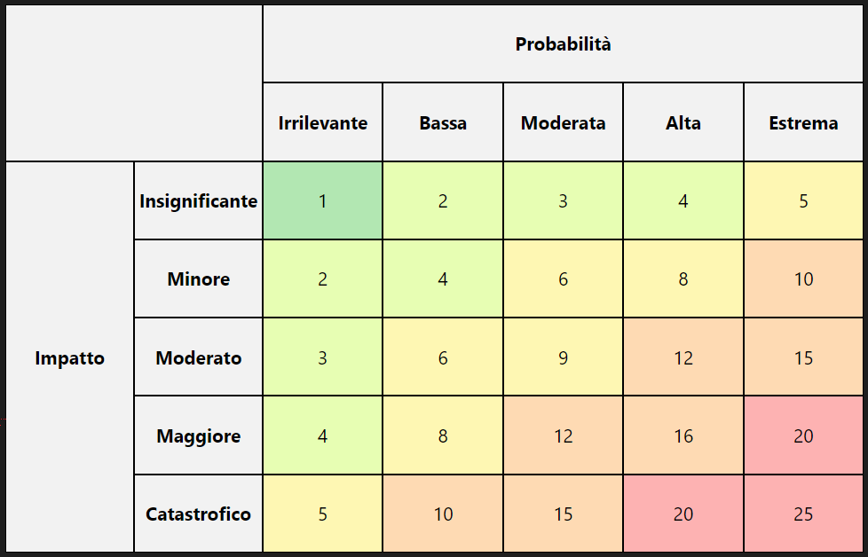

<strong>Rischio basso:</strong> I rischi in questa categoria sono di lieve entità e hanno un impatto minimo sugli obiettivi del progetto. Inoltre è improbabile che si realizzino e, di conseguenza, che influenzino significativamente la tempistica, il budget o la qualità del progetto.

<strong>Rischio medio basso:</strong> Questi rischi possono avere un impatto o una probabilità di avvenire bassi, il che li rende gestibili. Solitamente richiedono un'attenzione più attiva per evitare che si trasformino in problemi più gravi, ma possono essere mitigati con azioni correttive standard.

<strong>Rischio medio:</strong> I rischi di livello medio rappresentano una minaccia che potrebbe avere un impatto tangibile sul progetto. La loro gestione richiede monitoraggio e l'implementazione di piani di mitigazione ben definiti.

<strong>Rischio medio alto:</strong> Questi rischi hanno probabilità di avvenire o impatto sul progetto alti. Necessitano di un'attenzione immediata e di piani di risposta ben strutturati per prevenire o minimizzare l'impatto negativo.

<strong>Rischio alto:</strong>  rischi ad alto livello sono sia molto probabili che fortemente impattanti, possono dunque compromettere in modo significativo il successo del progetto. Richiedono un piano di gestione dei rischi ben dettagliato e l'impegno costante del management. Un elevato numero di rischi di tale natura possono far desistere dall'intraprendere un progetto.

  

<table>
    <tr>
        <th colspan="2" rowspan="2"></th>
        <th colspan="5">Probabilità</th>
    </tr>
    <tr>
        <th >Irrilevante</th>
        <th >Bassa      </th>
        <th >Moderata   </th>
        <th >Alta       </th>
        <th >Estrema    </th>
    </tr>
    <tr>
        <th rowspan="5">Impatto</th>
        <th>Insignificante</th>
        <td class="low">1</td>
        <td class="medium_low">2</td>
        <td class="medium_low">3</td>
        <td class="medium_low">4</td>
        <td class="medium">5</td>
    </tr>
    <tr>
        <th>Minore</th>
        <td class="medium_low">2</td>
        <td class="medium_low">4</td>
        <td class="medium">6</td>
        <td class="medium">8</td>
        <td class="medium_high">10</td>
    </tr>
    <tr>
        <th>Moderato</th>
        <td class="medium_low">3</td>
        <td class="medium">6</td>
        <td class="medium">9</td>
        <td class="medium_high">12</td>
        <td class="medium_high">15</td>
    </tr>
    <tr>
        <th>Maggiore</th>
        <td class="medium_low">4</td>
        <td class="medium">8</td>
        <td class="medium_high">12</td>
        <td class="medium_high">16</td>
        <td class="high">20</td>
    </tr>
    <tr>
        <th>Catastrofico</th>
        <td class="medium">5</td>
        <td class="medium_high">10</td>
        <td class="medium_high">15</td>
        <td class="high">20</td>
        <td class="high">25</td>
    </tr>
</table>

<h3> 1.1 b</h3> 
<strong> Rischio:</strong> incontrare problemi di natura organizzativa che impediscano il rispetto dei tempi di consegna. 
<strong> Probabilità:</strong> Alta 
<strong> Impatto:</strong> Catastrofico 
<strong> Stima del rischio:</strong> 20  
<strong> Motivazione alla stima del rischio:</strong>  
<strong> Gestione Rischio:</strong>    

<h3> 1.1 b</h3> 
<strong> Rischio:</strong> incontrare problemi di natura organizzativa che impediscano il rispetto dei tempi di consegna. 
<strong> Probabilità:</strong> Alta 
<strong> Impatto:</strong> Catastrofico 
<strong> Stima del rischio:</strong> 20  
<strong> Motivazione alla stima del rischio:</strong>  
<strong> Gestione Rischio:</strong>   

<h3> 1.1 b</h3> 
<strong> Rischio:</strong> incontrare problemi di natura organizzativa che impediscano il rispetto dei tempi di consegna. 
<strong> Probabilità:</strong> Alta 
<strong> Impatto:</strong> Catastrofico 
<strong> Stima del rischio:</strong> 20  
<strong> Motivazione alla stima del rischio:</strong>  
<strong> Gestione Rischio:</strong>   

<h3> 1.1 b</h3> 
<strong> Rischio:</strong> incontrare problemi di natura organizzativa che impediscano il rispetto dei tempi di consegna. 
<strong> Probabilità:</strong> Alta 
<strong> Impatto:</strong> Catastrofico 
<strong> Stima del rischio:</strong> 20  
<strong> Motivazione alla stima del rischio:</strong>  
<strong> Gestione Rischio:</strong>  

<h3> 1.1 b</h3> 
<strong> Rischio:</strong> incontrare problemi di natura organizzativa che impediscano il rispetto dei tempi di consegna. 
<strong> Probabilità:</strong> Alta 
<strong> Impatto:</strong> Catastrofico 
<strong> Stima del rischio:</strong> 20  
<strong> Motivazione alla stima del rischio:</strong>  
<strong> Gestione Rischio:</strong>  

--------------------------------------------------------
--------------------------------------------------------
--------------------------------------------------------
--------------------------------------------------------
--------------------------------------------------------
--------------------------------------------------------

<h3> 1.1 a</h3> 
<strong> Rischio:</strong> incontrare problemi di natura tecnologica che impediscano il rispetto dei tempi di consegna. 
<strong> Probabilità:</strong> Bassa 
<strong> Impatto:</strong> Maggiore 
<strong> Stima del rischio:</strong> 8 
<strong> Motivazione alla stima del rischio:</strong> la tecnologia è conosciuta, nonstante questo, vi è la possibilità che qualche problema emerga, e i tempi di consegna rappresentano un requisito alquanto stringente 
<strong> Gestione Rischio:</strong> Contingency Planning, conoscendo i nostri punti deboli riguardo alle tecnologie, si contatta un esperto nelle tecnologie più problematiche e si contratta un eventiale disponibilità. L'esperto è stato individuato all'interno della stessa Mintendo, in quanto sono i maggiori esperti della console da loro prodotta.

<h3> 1.1 b</h3> 
<strong> Rischio:</strong> incontrare problemi di natura organizzativa che impediscano il rispetto dei tempi di consegna. 
<strong> Probabilità:</strong> Alta 
<strong> Impatto:</strong> Catastrofico 
<strong> Stima del rischio:</strong> 20  
<strong> Motivazione alla stima del rischio:</strong> Questo progetto è il più grande tra quelli intrapresi dall'azienda, impiegherà tutti i dipendenti per un lungo periodo di tempo,e i tempi di consegna rappresentano un requisito alquanto stringente  
<strong> Gestione Rischio:</strong> Mitigazione, si effettuerà fin da subito un'organizzazione dettagliata del lavoro, che comprenda un'attenta assegnazione dei compiti ai team, secondo le skill dei membri, nonchè un'attenta valutazione delle priorità delle varie task e della loro possibile parallelizzazione.

<h3> 1.1 c</h3> 
<strong> Rischio:</strong> incontrare problemi dovuti all'aggiunta di nuove funzionalità che impediscano il rispetto dei tempi di consegna. 
<strong> Probabilità:</strong> Alta 
<strong> Impatto:</strong> Maggiiore 
<strong> Stima del rischio:</strong> 16  
<strong> Motivazione alla stima del rischio:</strong> Si è a conoscenza del fatto che i requisiti possono essere soggetti a cambiamenti dovuti sia al committente che ai desideri dell'utenza finale, e i tempi di consegna rappresentano un requisito alquanto stringente 
<strong> Gestione Rischio:</strong> Mitigazione, fin dall'inizio del progetto si stabiliranno le date di meeting con il committente e con possibili suoi clienti, che avverranno in maniera frequente, in modo da individuare fin da subito eventuali problemi e le corrispondenti soluzioni.

<h3> 2.1</h3> 
<strong> Rischio:</strong> ottenere un videogioco troppo lontano dai moderni standard. 
<strong> Probabilità:</strong> Bassa 
<strong> Impatto:</strong> Maggiore 
<strong> Stima del rischio:</strong> 8  
<strong> Motivazione alla stima del rischio:</strong> I nuovi giocatori hanno una grande importanza per mantenere il brand attivo, e come azienda abbaimo esperienza nel creare videogiochi compatibili con gli standard moderni  
<strong> Gestione Rischio:</strong> Mitigazione, fin dall'inizio del progetto si stabiliranno le date di meeting con possibili clienti target per effettuare usability test.

<h3> 2.2 </h3> 
<strong> Rischio:</strong> ottenere un prodotto non in linea con le aspettative degli appassionati di lunga data. 
<strong> Probabilità:</strong> Alta 
<strong> Impatto:</strong> Minore 
<strong> Stima del rischio:</strong> 8  
<strong> Motivazione alla stima del rischio:</strong> I giocatori di lunga data hanno aspettative difficili da soddisfare, ma il brand non risente in modo particolare di un eventuale malcontento  
<strong> Gestione Rischio:</strong> Mitigazione/Contingency Plan, fin dall'inizio del progetto si stabiliranno le date di meeting con possibili clienti target, sebbene con frequenza molto ridotta rispetto all'altra categoria di utenti. Nel caso emergano recensioni particolarmente negative dopo la release, si programma di far uscire una patch che migliori la situazione.

<h3> 3.1</h3> 
<strong> Rischio:</strong> non riuscire a bilanciare i contenuti all'interno dei trailer in modo che essi stimolino curiosità. 
<strong> Probabilità:</strong> Irrilevante 
<strong> Impatto:</strong> Minore 
<strong> Stima del rischio:</strong> 2  
<strong> Motivazione alla stima del rischio:</strong> Abbiamo prodotto altri trailer, quindi la probabilità di incorrere in errori di questo tipo è bassa, inoltre l'utenza del brand nutre un particolare interesse iniziale nei suoi confronti l'impatto è moderato per la stessa ragione  
<strong> Gestione Rischio:</strong> Accettazione - Contingency Plan, se un trailer ottiene delle reazioni particolarmente negative si potranno visionare i trailer del brand Dibimon che hanno avuto successo negli anni passati e si tenterà di produrre trailer più interessanti su questa base.

<h3> 3.2 </h3> 
<strong> Rischio:</strong> 
Mostrare troppi contenuti all'interno dei trailer che rivelano eccessivamente le caratteristiche del videogioco. 
<strong> Probabilità:</strong> Moderata 
<strong> Impatto:</strong> Minore
<strong> Stima del rischio:</strong> 6  
<strong> Motivazione alla stima del rischio:</strong> Essendo un remake, molte parti del videogioco sono ben note ai futuri utenti, inoltre le novità, per quanto presenti, sono nettamente inferiori in numero rispetto a quelle presenti in un nuovo videogioco. Ne consegue che risulta difficile mostrare delle feature nuove senza mostrarne troppe.  
<strong> Gestione Rischio:</strong> Mitigazione prima dell'ideazione del trailer si contatterà la Mintendo per decidere esattamente cosa mostrare e cosa no.

<h3> 3.3 </h3> 
<strong> Rischio:</strong> mancata approvazione del trailer da parte di Mintendo e mancanza di tempo per effettuare le modifiche necessarie. 
<strong> Probabilità:</strong> Moderata 
<strong> Impatto:</strong> Moderato 
<strong> Stima del rischio:</strong> 9  
<strong> Motivazione alla stima del rischio:</strong> sebbene non sia improbabile che un problema simile si verifichi, un ritardo nell'uscita del trailer, non sarà particolarmente impatttante.  
<strong> Gestione Rischio:</strong> Mitigazione prima dell'ideazione del trailer si contatterà la Mintendo per ottenere linee guida chiare.

<h3> 4.1 </h3> 
<strong> Rischio:</strong> data mining sul contenuto del gioco. 
<strong> Probabilità:</strong> Estrema 
<strong> Impatto:</strong> Moderato 
<strong> Stima del rischio:</strong> 15  
<strong> Motivazione alla stima del rischio:</strong> Basandosi su esperienze passate, si può dire che sia cosa nota che sarà effettuato data mining sulla demo nella speranza di ottenre informazioni aggiuntive sul videogioco prima della data di uscita. L'impatto è moderato, poichè ciò non inficierà sul numero di copie vendute.  
<strong> Gestione Rischio:</strong> Mitigazione, conoscendo il problema si presterà particolare attenzione nell' eliminazione di parti di codice sensibili dalla demo.

<h3> 4.2 </h3> 
<strong> Rischio:</strong> la demo potrebbe non essere abbastanza coinvolgente o interessante da convincere i giocatori a comprare il gioco completo. 
<strong> Probabilità:</strong> Irrilevante 
<strong> Impatto:</strong> Maggiore 
<strong> Stima del rischio:</strong> 4  
<strong> Motivazione alla stima del rischio:</strong> Abbiamo prodotto altre demo, quindi la probabilità di incorrere in errori di questo tipo è bassa, inoltre sebbene l'utenza del brand nutre un particolare interesse iniziale nei suoi confronti l'impatto è maggiore poichè la demo ha una rilevanza significativa nella decisione sull'acquisto. 
<strong> Gestione Rischio:</strong> Mitigazione durante la creazione della demo si contatteranno la Mintendo e suoi potenziali clienti per ottenere pareri correttivi.

<h3> 4.3 </h3> 
<strong> Rischio:</strong> 
La demo potrebbe rivelare troppi dettagli della trama o dei contenuti del gioco, riducendo l'interesse dei giocatori per il gioco completo. 
<strong> Probabilità:</strong> Moderata 
<strong> Impatto:</strong> Insignificante
<strong> Stima del rischio:</strong> 3  
<strong> Motivazione alla stima del rischio:</strong> Sebbene risulti difficile mostrare delle feature nuove senza mostrarne troppe, l'utenza è più propensa a comprare il gioco se la demo è stata gradita, anche se mostra meccaniche che non dovevano ancora apparire.  
<strong> Gestione Rischio:</strong> Mitigazione, prima dell'ideazione del trailer si contatterà la Mintendo per decidere esattamente cosa mostrare e cosa no.

<h3> 4.4 </h3> 
<strong> Rischio:</strong> mancata approvazione della demo da parte di Mintendo e mancanza di tempo per effettuare le modifiche necessarie. 
<strong> Probabilità:</strong> Moderata 
<strong> Impatto:</strong> Maggiore 
<strong> Stima del rischio:</strong> 12  
<strong> Motivazione alla stima del rischio:</strong> è plausibile che un problema simile si verifichi, e sebbene un piccolo ritardo nell'uscita della demo, non sia particolarmente impatttante, un ritardo maggiore può provocare problemi di marketing.  
<strong> Gestione Rischio:</strong> Mitigazione prima dell'ideazione del trailer si contatterà la Mintendo per ottenere linee guida chiare.

<h3> 5.1 </h3> 
<strong> Rischio:</strong> formato dati non compatibile e conseguente necessità di conversione per l'interazione con altri dispositivi. 
<strong> Probabilità:</strong> Moderata 
<strong> Impatto:</strong> Maggiore 
<strong> Stima del rischio:</strong> 12  
<strong> Motivazione alla stima del rischio:</strong> è plausibile che un problema simile si verifichi, l'impatto in tal caso è considerevole poichè potrebbero venir meno delle funzionalità.  
<strong> Gestione Rischio:</strong> Contingency Plan, conoscendo il probelma, si contatta un esperto nelle conversioni dati di questa tipologia e si contratta un eventiale disponibilità. L'esperto è stato individuato all'interno della stessa Mintendo, in quanto sono i maggiori esperti dei software con cui srà necessario connettersi.

<h3> 6.1 </h3> 
<strong> Rischio:</strong> gli errori critici rilevati dopo il lancio sono di grande portata e non correggibili in tempi brevi. 
<strong> Probabilità:</strong> Bassa 
<strong> Impatto:</strong> Catastrofico 
<strong> Stima del rischio:</strong> 10  
<strong> Motivazione alla stima del rischio:</strong> Se presenti, gli errori critici non correggibili in tempi brevi, possono avere un forte impatto sulla giocabilità del prodotto e quindi sulla soddisfazione del cliente finale. Nonostante ciò la probabilità che ciò avvenga è fortunatamente bassa 
<strong> Gestione Rischio:</strong> Mitigazione, svolgimento di numerose e frequenti testing session, anche con utenti finali, specialmente nel periodo che intercorre tra il completamento del software e il suo rilascio

<h3> 6.2 a </h3> 
<strong> Rischio:</strong> le nuove funzionalità online aggiunte dopo il lancio non suscitano l'interesse sperato. 
<strong> Probabilità:</strong> Bassa 
<strong> Impatto:</strong> Moderato 
<strong> Stima del rischio:</strong> 6  
<strong> Motivazione alla stima del rischio:</strong> l'impatto sull'aggiunta di nuove funzionalità che non suscitano particolare interesse è moderata poichè non impatta particolarmente le categorie di giocatori che non giocano online. 
<strong> Gestione Rischio:</strong> Acceptance-Contngency Plan, se una funzionalità non suscita l'interesse sperato, prima di produrre la successiva si effettueranno maggiori survey.

<h3> 6.2 b </h3> 
<strong> Rischio:</strong> e nuove funzionalità online aggiunte dopo il lancio introducono errori. 
<strong> Probabilità:</strong> Bassa 
<strong> Impatto:</strong> Maggiore 
<strong> Stima del rischio:</strong> 8  
<strong> Motivazione alla stima del rischio:</strong> l'impatto sull'aggiunta di nuove funzionalità che introducono errori è maggiore poichè potrebbe impattare funzionalatità precedentemente gradite. 
<strong> Gestione Rischio:</strong> Contngency Plan, se una funzionalità introduce errori, si tenterà di rilasciare quanto prima una patch correttiva.

 

[Menu](../../index.md)